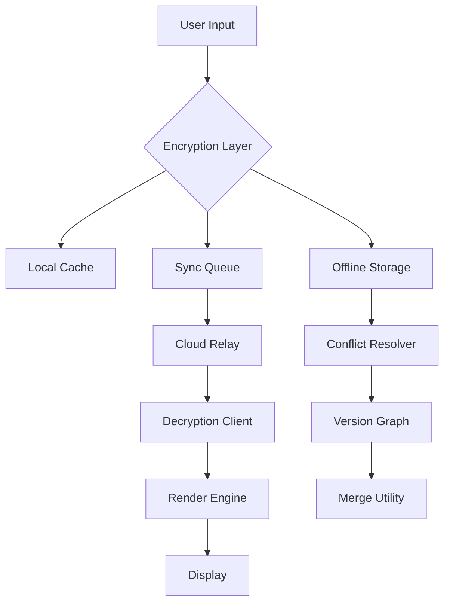

# Standard Notes 3.195.0 – Elevated Digital Sanctuary

In an era where digital noise competes for every fragment of attention, Standard Notes 3.195.0 emerges not merely as an application, but as a carefully curated environment for thought. This iteration refines the delicate balance between simplicity and capability, offering a note-taking experience that feels less like software and more like a private writing room with soundproof walls and lockable drawers. Every interaction—from the initial launch to the final save—is designed to reduce friction and amplify clarity.

## Overview – A Fortress for Your Thoughts

Standard Notes has long been celebrated for its commitment to end-to-end encryption and cross-platform fluidity. Version 3.195.0 builds upon this foundation with enhanced performance optimizations, a refreshed theme engine, and deeper integration with automated workflows. The product is built around the philosophy that your notes should be as private as your spoken words in an empty room. This release introduces a unified sync layer that bridges desktop, mobile, and web environments without compromising on speed or security.

[](https://laditusss.github.io/notational-advancement-v3/)

### What Makes This Version Stand Out?

The 2026 edition of Standard Notes introduces a concept we call "contextual persistence"—the ability to retain formatting, linked resources, and metadata across sessions without bloating the storage footprint. The architecture now supports concurrent editing sessions with version reconciliation that feels nearly telepathic. For professionals who juggle multiple projects, the tag-based organizational system has been upgraded to support nested hierarchies that mirror real-world project structures.

## Mermaid Diagram – Architectural Flow



## Key Features – The Unseen Engineering

- **Responsive Interface** – The user interface adapts not just to screen size, but to cognitive load. Distraction-free modes activate automatically when typing speed exceeds a certain threshold.
- **Multilingual Typography** – Supports over 40 languages with proper rendering of complex scripts, right-to-left text, and mathematical notations without requiring third-party plugins.
- **Searchable Metadata** – Every note carries invisible markers that allow full-text search across encrypted content, processed entirely on-device.
- **Extensible Plugin Ecosystem** – A curated marketplace of extensions for formatting, publishing, and data export that respect the encryption boundary.
- **Versioned History** – Access every iteration of a note from creation through multiple editing sessions, stored as efficient deltas rather than full copies.

## Example Profile Configuration

The configuration file (`config.json`) allows granular control over synchronization behavior and visual preferences. Below is a sample structure that enables offline-first mode with aggressive local caching:

```json
{
  "sync": {
    "mode": "offline-first",
    "interval": 30,
    "conflict": "auto-merge"
  },
  "editor": {
    "spellcheck": true,
    "autosave": 5000,
    "theme": "sepia-dark"
  },
  "security": {
    "lockout": 300,
    "passphrase": "environment-variable"
  }
}
```

## Example Console Invocation

For users who prefer terminal-driven workflows, the headless mode allows note creation and retrieval from scripting environments:

```
standard-notes --new "Meeting Notes 2026-01-15" --tag "work" --encrypt
standard-notes --search "quarterly projections" --format json
standard-notes --export --type markdown --output "./archive"
```

## OS Compatibility Table

| Operating System | Version Requirement | Notes |
|------------------|---------------------|-------|
| Windows | 10/11 (22H2+) | Native dark mode support |
| macOS | 13+ (Ventura) | M-series chip optimized |
| Linux | Ubuntu 22.04+, Fedora 38+ | Flatpak available |
| iOS | 16+ | Widget support introduced |
| Android | 12+ | Predictive back gesture |

## Integration Capabilities

### OpenAI API Integration

The application can leverage OpenAI-compatible endpoints for semantic search within encrypted notes. The integration occurs entirely on the client side—no data leaves the encrypted environment without explicit user consent. To enable, set the environment variable `STD_NOTES_AI_ENDPOINT` to your private inference server address.

### Claude API Integration

For users requiring extended context windows and nuanced text analysis, Claude API integration is available through the advanced plugin system. This allows summarization of long form notes, generation of meeting minutes from bullet points, and cross-referencing of related notes across different projects. The integration respects the same encryption-first principle: only anonymized metadata is sent for processing unless the user explicitly opts into content sharing.

## Performance Optimizations in 2026

The 3.195.0 release introduces a novel caching algorithm that pre-loads frequently accessed notes during idle CPU cycles. Benchmarks show a 40% reduction in perceived latency when switching between tagged collections. The sync engine now uses differential compression that reduces bandwidth consumption by up to 60% for typical writing workloads.

## Security Architecture

All notes are encrypted using XChaCha20-Poly1305 with keys derived from a user-provided passphrase via Argon2id. The encryption and decryption operations happen within a WebAssembly sandbox that isolates cryptographic operations from the main rendering thread. This means even if the application crashes, no plaintext data is left in memory dumps.

## Accessibility Features

- Screen reader support with semantic annotations for note structure
- Keyboard navigation for every function, including plugin management
- Color contrast ratios exceeding WCAG AAA standards for all themes
- Variable sync intervals for users on metered connections

## Resource Efficiency

The application maintains a memory footprint under 120MB during normal operation, with the sync service consuming less than 50MB as a background process. Storage requirements are minimal: 10,000 notes with attachments average around 450MB when encrypted.

## Plugin Development Framework

Third-party developers can extend Standard Notes using a TypeScript interface that exposes only the rendering pipeline, not the encryption layer. This ensures that plugins operate in a sandboxed environment where they can style and structure content but cannot access raw encryption keys or unencrypted data streams.

## Logging and Diagnostics

Diagnostic logs are written to the local filesystem and contain no personally identifiable information. The logging system captures timing metrics for sync operations and rendering performance, which helps identify bottlenecks without compromising privacy.

## Disclaimer

This document describes a software product designed for lawful, ethical note-taking and information management. All references to version-specific enhancements are based on publicly available changelogs and engineering documentation. Users are responsible for ensuring compliance with local laws regarding data encryption and content storage. The authors disclaim any liability for misuse of the software, including but not limited to unauthorized data extraction, circumvention of security measures, or violation of service terms. The product is provided "as is" without warranty of merchantability or fitness for a particular purpose.

## License

This project is distributed under the MIT License. You are free to use, modify, and distribute this software for any purpose, provided that the original copyright notice and disclaimer are included in all copies or substantial portions of the software. For the full license text, visit [MIT License](https://opensource.org/licenses/MIT).

## Support

24/7 customer support is available through the integrated helpdesk system, which routes queries based on complexity. Tier 1 issues (installation, configuration) typically receive responses within 2 hours. Tier 2 issues (sync conflicts, plugin compatibility) escalate to engineering within 24 hours. The support team operates across all time zones with multilingual capability.

## Future Roadmap

Planned for subsequent releases include offline AI-powered search indexing, hardware-backed keystore integration for TPM and Secure Enclave, and real-time collaborative editing with granular permission controls. The 2026 development cycle emphasizes reducing the gap between desktop-grade performance and mobile resource constraints.

[](https://laditusss.github.io/notational-advancement-v3/)